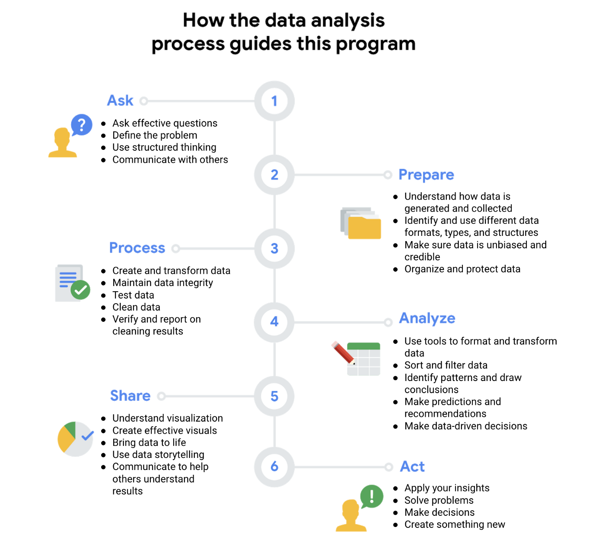
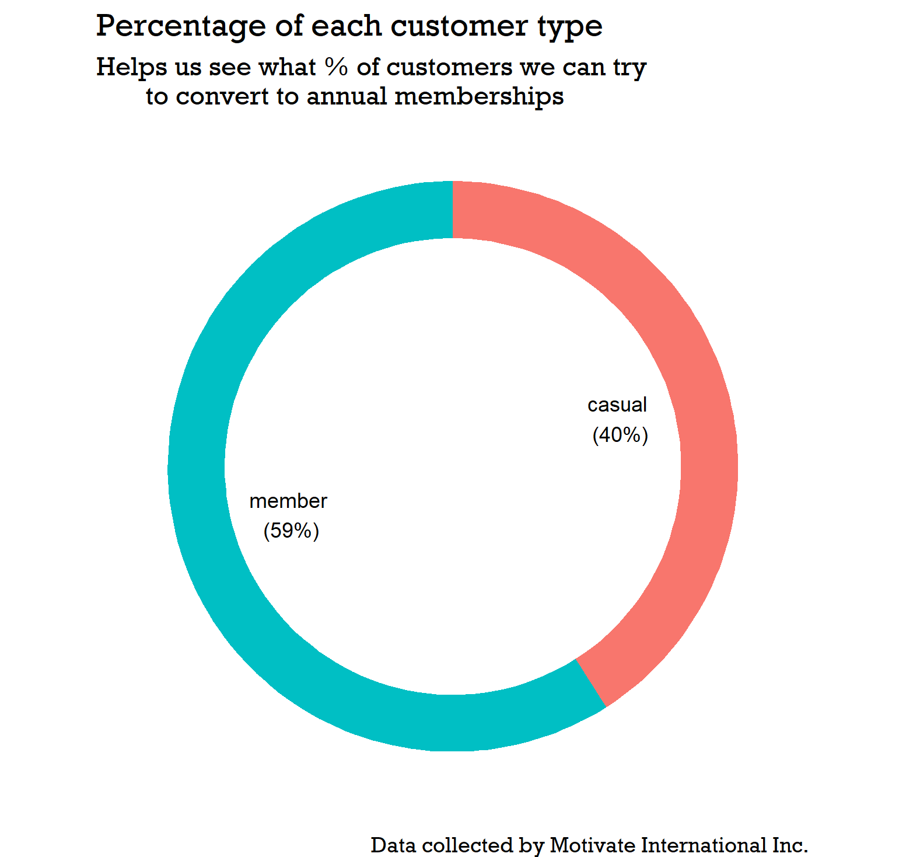
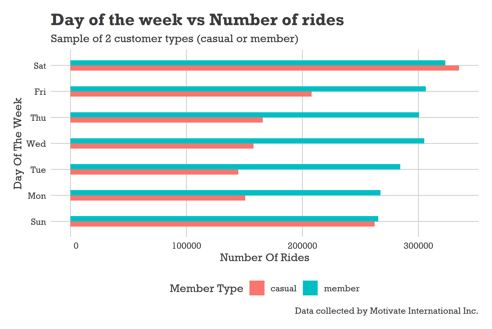
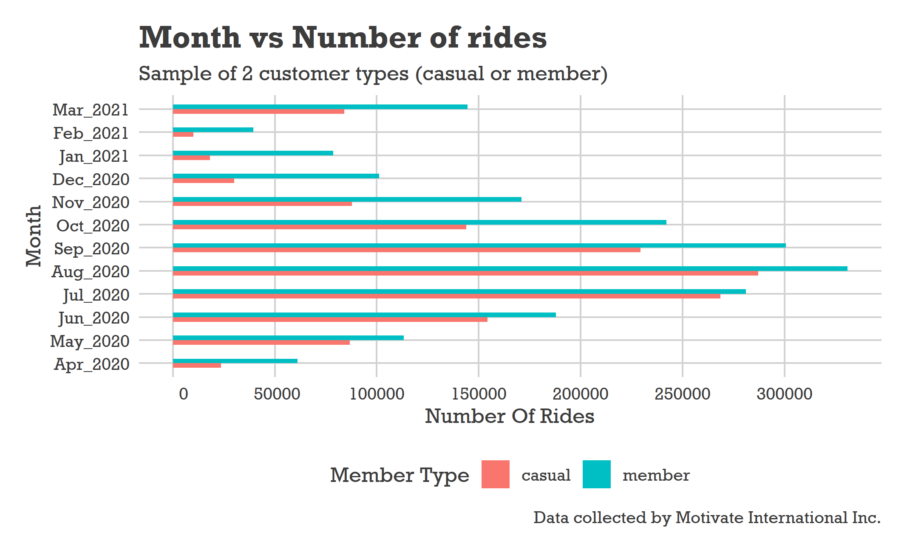
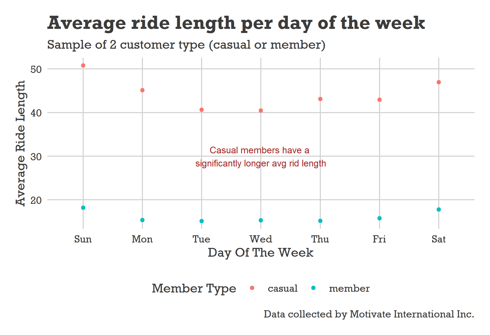
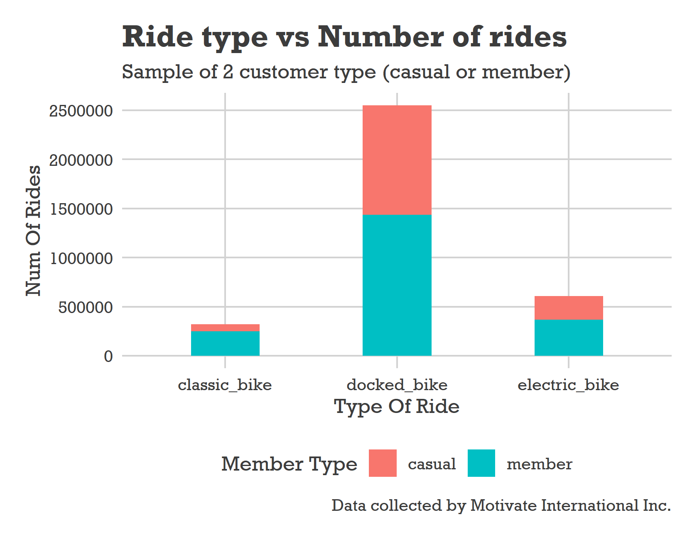
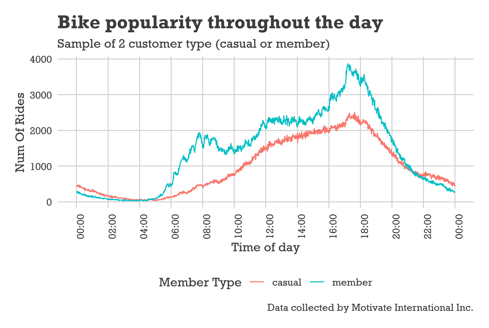

---
# This section is in yaml (metadata), you can customize alot!
title: "Google Bike Trips Case Study - Report"
author: "Mathews Joy"
date: "10/08/2021"
# You can add a table of contents (TOC) using the toc option and specify the depth of headers that it
#applies to using the toc_depth option. We use 2 as we only have 2 headers
output:
  prettydoc::html_pretty:
    theme: architect
    highlight: github
    toc: true
   #toc_float: true # This will float the TOC on the left so you can always see it
---

<!-- You can use direct css in the markdown file to customize thing such as font size -->
<style type="text/css">
  body{
  font-size: 10pt;
}
</style>

<!-- is used to specify any global settings to be applied to the R Markdown script. The example sets all code chunks as “echo=TRUE”, meaning they will be included in the final rendered version. You can specify other settings in this code chunk, such as the working directory. -->
```{r setup, include=FALSE}
knitr::opts_chunk$set(echo = TRUE)
```

```{r echo=FALSE, include=FALSE}
library(tidyverse)
library(lubridate)
library(ggplot2)
library(data.table)
library(ggthemes)
library(tibble)
library(knitr)
getmode <- function(v) {
  uniqv <- unique(v)
  uniqv[which.max(tabulate(match(v, uniqv)))]
}
windowsFonts(font = windowsFont("Rockwell"))
all_bike_trips_v2 <- read_csv("data_sets/BikeCleanedData.csv")
```

## Overview of the project

#### Introduction

This case study is the final capstone project for the Google [Data Analytics Professional Certificate](https://www.coursera.org/professional-certificates/google-data-analytics). We are helping a company located in
chicago called "Cyclistic", and we are working as apart of the data analytics team.

Cyclistic, a bike-share program that features more than 5,800 bicycles and 600 docking stations. Cyclistic sets itself
apart by also offering reclining bikes, hand tricycles, and cargo bikes, making bike-share more inclusive to people with
disabilities and riders who can’t use a standard two-wheeled bike. The majority of riders opt for traditional bikes; about
8% of riders use the assistive options. Cyclistic users are more likely to ride for leisure, but about 30% use them to
commute to work each day.

This report will walk through the 6 phases of data analysis in detail. I will also include a summary section (Ask Phase) at the end of the recommendations I think Cyclistic should take on board, in order to successfully grow their business further.

<center></center><center><a style="font-size:10px">Source: Google Data Analyst Course</a></center>


## Ask Phase

#### Objectives

Our primary questions to explore and gather information on are:

* How do annual members and casual riders use Cyclistic bikes differently?
Cyclistic has 2 types of members "casual" and "member". Customers who purchase single-ride or full-day passes are referred to as casual riders. Customers who purchase annual memberships are Cyclistic members.
* How can we maximize annual members?
The more annual members the business can get the better for long-term performance.

#### Key Stakeholders To Consider

**Lily Moreno**: The director of marketing and your manager. Moreno is responsible for the development of campaigns
and initiatives to promote the bike-share program.

**Cyclistic executive team**: The notoriously detail-oriented executive team will decide whether to approve the
recommended marketing program.

(Other stakeholders include investors, employees, customers, and suppliers)


## Prepare Phase

#### The data source

The data source is a set of [12 different data sets](https://divvy-tripdata.s3.amazonaws.com/index.html), each one containing the information for every month of the year (April 2020 - March 2021). The data is provided by Motivate International Inc. under this
[licence](https://www.divvybikes.com/data-license-agreement). Each data set was prior cleaned to remove any rider's personal information,
to prevent breaching any data confidentiality regulations.

The data source was used as it meets all the **"ROCCC" (Reliable, Original, Comprehensive, Current, Cited)** features.  
- The data is reliable as it is provided by a reputable source (Google).  
- Data is original as it is coming from the primary source, and not from a second/third-party source.  
- Data is comprehensive because it contains sufficient data that we can use to gather useful insights.   
- The data is current as it provides us with data sets within the past year (at the time of making this report).  
- Data sets used have been cited/vetted.


## Process Phase

#### Tools I used and why

For this case study, I decided the best tool to use was R as it provides easy manipulation and processing of large data sets, and also
provides me with the ability to make clear and comprehensive visualizations. I decided not to use SQL or Excel as excel struggles with larger data sets, and SQL wasn't very necessary for this large as we wasn't working with any databases. There is also the option to use
Tableau for the visualizations, however since R already provides ``ggplot2`` which serves the needs for this specific project I decided not to use Tableau. Furthermore, by using R it helps me learn to properly for the first time.

#### How I ensured data integrity & data is clean to use for analysis

I first loaded all 12 data sets into R and examined the structure, data types and naming for inconsistency across the 12 data sets.
I noticed ```start_station_id``` and ```end_station_id``` columns are char datatype in dec20 - mar21 (should be double), So I converted then to double to keep consistency when we joining all 12 data sets into 1. After joining all 12 data sets into 1, we can notice that some of the naming of the columns could be more readable, e.g ```member_casual``` can be changed to ```type_of_member```.  
A new column called ```ride_length``` was added to find total trip duration in minutes by finding diff between ended and started dates, this can be used for further analysis later. After adding this new column we need to check for any negatives values, also We have been informed that the company had "test" stations used for quality checks So we can see how many there are. Have checking we have gathered there are 3367 tests, and 10552 negative values, so we can remove these from the data-set as they can cause issues in the future. We should create a new data frame for this as we are removing data.  

Another important aspect I considered to ensure data integrity was to account for any null/empty values. I gathered there was ```1057208``` total NA values which is is **2.03%** of ```52132260``` (total values). We have concluded all the null values are in start_station_id and end_station_id which are not important columns for us when we analyze, however in order to prevent
data bias we will keep the NA rows as the more important data is still present. Another option is to match name and id, by comparing to existing data, however for our scope of this project it isn't necessary.

There was also further cleaning done including removing columns not needed from the data set,fixing structural issues and adding columns for further analysis. The full explanation of the cleaning process with the code can be found in the R script file (*bike_trips_analysis.R*), which is located in the [GitHub repository](https://github.com/mathewsjoyy/Google-DataAnalysis-CaseStudy) for this project.

Finally, I saved the fully cleaned data set for future use, and also as a backup. 
```{r,results="hide",message = FALSE, warning = FALSE, eval=FALSE}
write.csv(all_bike_trips_v2,file="data_sets/BikeCleanedData.csv",row.names=FALSE)
```
This data can also be viewed for use by finding the *BikeCleanedData.csv* file.


## Analyze & Share Phase

#### Initial analysis

First I ran few calculations to get a better sense of the data layout:  
● Calculate the mean of ride_length  
● Calculate the max ride_length  
● Calculate the mode of day_of_week  
● Calculate the average ride_length for members and casual riders. 

● I then made a few tables to find more insightful data, such as below.

```{r results='asis'}
df1 <- all_bike_trips_v2 %>% group_by(type_of_member) %>%
  summarise( max_trip_duration = max(ride_length),
            mean_trip_duration = mean(ride_length), mode_week_day = getmode(day_of_week),
            most_popular_bike_type = getmode(type_of_ride))

kable(df1)

```
From the result above we can see the most popular day of the week for both member and casual riders is 
Saturday, this can be a strong indication that advertisement and other programs should all be heavily focused on this specific day. Furthermore, the data tells us that casual riders usually take the bikes out for a longer duration compared to members.

#### In-depth analysis

**Lets now analyze in more depth and create some visualizations.**

---

<center>**First, we can find the percentage of the 2 different types of customers, both member and casual.**</center>

```{r echo=TRUE, eval=FALSE}
# Make a temp df of the data we got
df <- data.frame(
  category =c("casual", "member"),
  count = c(1423876,2051968)
)

df$fraction = df$count / sum(df$count)
df$ymax = cumsum(df$fraction)
df$ymin = c(0, head(df$ymax, n=-1))
df$labelPos <- (df$ymax + df$ymin) / 2
df$label <- paste0(df$category, "\n (", floor(df$fraction*100),"%)")

# Make the plot
ggplot(df, aes(ymax=ymax, ymin=ymin, xmax=4, xmin=3, fill=category)) +
  geom_rect() +
  geom_text(x=2, aes(y=labelPos, label=label), size=3) +
  coord_polar(theta="y") + 
  xlim(c(-1, 4)) +
  theme_void() + # Gets rid of unnecessary background, axis, labels
  theme(legend.position = "none") +
  labs(title="Percentage of each customer type", subtitle="Helps us see what % of customers we can try
       to convert to annual memberships",
     caption="Data collected by Motivate International Inc.") +
  theme(text = element_text(family = "font"))
```



As we can see 59% of riders are members and 40% are casual, which means more then half of the customer base is a member, this is a positive metric, but can be improved.

Overall member customers are more profitable then casual customers, so we need to try find out how to convert more casual riders
to members with further analysis. Although getting 100% of the customers as members is very unlikely, aiming to get to 65 - 75 % can be an optimistic goal.

This information can also help us ask more questions about the data such as:    
What are the number of trips per customer type annual?  
What ride type does each customer type prefer?

&nbsp;

---

<center>**How does the day of the week affect the total number of rides per customer type?**</center>

```{r echo=TRUE, eval=FALSE}
all_bike_trips_v2 %>% group_by(type_of_member, day_of_week) %>%
  summarise(num_of_rides = n()) %>%
  arrange(type_of_member, desc(num_of_rides)) %>%
  ggplot(aes(x=num_of_rides ,y=day_of_week, fill=type_of_member)) +
  labs(title="Day of the week vs Number of rides", subtitle="Sample of 2 customer types (casual or member)",
       caption="Data collected by Motivate International Inc.",x="Number Of Rides", y="Day Of The Week", fill="Member Type")+
  geom_col(width=0.4, position = "dodge", orientation = "y") +
  scale_x_continuous(labels = function(x) format(x, scientific = FALSE), n.breaks = 6) +# We want to scale x axis to no have scientific notation
  theme_fivethirtyeight() +
  theme(axis.title = element_text(),text = element_text(family = "font"))
```


From the graph we can examine casual customers are most busy on Sundays followed by Saturdays, while members are most busy on later half of the week extending into the weekend.

Interesting trend to note from the visualization is that members tend to have a consistent amount of rides throughout the week, while on the other hand casual riders have more popularity during the weekends (Saturday - Sunday). Potentially indicating that casual riders are parents/those who have full-time jobs.

&nbsp;

---

<center>**How does the month of the year affect the total number of rides per customer type?**</center>

```{r echo=TRUE,eval=FALSE}
all_bike_trips_v2 %>% group_by(type_of_member, month) %>%
  summarise(num_of_rides = n()) %>%
  arrange(type_of_member, desc(num_of_rides)) %>%
  ggplot(aes(x=num_of_rides ,y=month, fill=type_of_member)) +
  labs(title="Month vs Number of rides", subtitle="Sample of 2 customer types (casual or member)",
       caption="Data collected by Motivate International Inc.",x="Number Of Rides", y="Month", fill="Member Type")+
  geom_col(width=0.4, position = "dodge", orientation = "y") +
  scale_x_continuous(labels = function(x) format(x, scientific = FALSE), n.breaks = 6) +
  theme_fivethirtyeight() +
  theme(axis.title = element_text(),text = element_text(family = "font")) 
```


We can see from the second quarter (July - September) was the most popular time of year, August being were number of rides
peaked for both customer types. Between July - September accounted for almost 50% of all rides.

The most stunted part of the year is from December - February, this could be due to external factors such as the colder weather at this time, and so less motivation for people to go on rides. However, the overall ride count
for members was twice - three times bigger, suggesting member riders still have time/motivation to keep consistent throughout the year.

&nbsp;

---

<center>**Does day of the week affect customers average ride duration?**</center>

```{r echo=TRUE, eval=FALSE}
all_bike_trips_v2 %>% group_by(type_of_member, day_of_week) %>%
  summarise(avg_ride_length_mins = mean(ride_length)) %>%
  ggplot(aes(x=day_of_week,y=avg_ride_length_mins,color=type_of_member)) +
  geom_point() + 
  labs(title="Average ride length per day of the week",subtitle = "Sample of 2 customer type (casual or member)",
        caption="Data collected by Motivate International Inc.",color="Member Type",x="Day Of The Week",
        y="Average Ride Length") +
  theme_fivethirtyeight() +
  theme(axis.title = element_text(),text = element_text(family = "font"))+
  annotate("text",x=4, y=30, label="Casual members have a \nsignificantly longer avg rid length", size=3, colour="brown")
```


On average trip duration for casual riders is more then twice the amount for member riders. However we cannot know if this necessarily means that the routes are longer for casual riders, as casual riders could site see, and take more breaks.

The weekends also tend to result in longer trip duration this could possibly be due to riders having more time, as they might not have work during the weekends.

Overall we can see that the trip duration for member riders say consistent throughout the days of the week, unlike casual riders.

&nbsp;

---

<center>**What ride type does each type of customer prefer?**</center>

```{r echo=TRUE, eval=FALSE}
all_bike_trips_v2 %>% group_by(type_of_member, type_of_ride) %>%
  summarise(num_of_rides=n()) %>%
  ggplot(aes(x=type_of_ride,y=num_of_rides,fill=type_of_member)) +
  geom_col(width = 0.4) +
  scale_y_continuous(labels = function(y) format(y, scientific = FALSE), n.breaks = 6) +
  labs(title="Ride type vs Number of rides",subtitle = "Sample of 2 customer type (casual or member)",
       caption="Data collected by Motivate International Inc.",fill="Member Type",x="Type Of Ride",
       y="Num Of Rides") +
  theme_fivethirtyeight() +
  theme(axis.title = element_text(),text = element_text(family = "font"))
```


With a first glance at our analysis we can see that docked bikes have the most demand, by both member and casual riders equally,electric bikes leaning more popularity towards members, come second but by a significant gap, and finally classic bikes have the least demand and is more favored towards member riders.

Seeing member riders favor electric bikes over casual, it could be a good strategy to increase the arsenal of electric bikes.

Although there is no concrete information on the quantity of each bike type, we can infer the docked bikes do make a good portion of the total fleet.

&nbsp;

---

<center>**What is the demand of bikes over a 24 hour period (1 day)?**</center>

```{r echo=TRUE,eval=FALSE}
all_bike_trips_v2 %>% group_by(type_of_member, time) %>%
  summarise(num_of_rides=n()) %>%
  ggplot(aes(x=time, y=num_of_rides, color=type_of_member)) +
  geom_line() +
  labs(title="Bike popularity throughout the day",subtitle = "Sample of 2 customer type (casual or member)",
       caption="Data collected by Motivate International Inc.",color="Member Type",x="Time of day",
       y="Num Of Rides") +
  scale_x_datetime(date_breaks = "2 hour",date_labels = "%H:%M") +
  theme_fivethirtyeight() +
  theme(axis.title = element_text(), axis.text.x = element_text(angle = 90),text = element_text(family = "font"))
```


For both rider types the evenings between 4pm - 6pm is where most demand lays, this could potentially be as this is the time of day most people generally finish work / education. 

We can also see that the is a large spike in demand between 5am - 8am, and demand rapidly decreases after 8am. So we can speculate a lot of members have full-time/office jobs (however to confirm this we would need further data on the riders themselves).

Furthermore, popularity greatly declines after 10pm and stays well below 1000 riders until 4am.

&nbsp;

## Act Phase

#### Primary takeaways

* *Member and casual riders prefer docked bikes (70%) significantly more than electric or classic.*
* *Summer is the most popular season of the year for riders.*
* *Winter is the least popular season of the year for riders.*
* *Casual riders have almost twice the average trip duration compared to members.*
* *August the most popular month of the year, while February is the least popular.*

#### My top 3 recommendations for Cyclistic

**1. Since Summer is the most popular time of year focusing marketing campaigns and advertisements at this time of year could help draw in more customers.Also providing weekly/monthly memberships can help unsure customers get a better sense of if they want to commit to a full annual membership.**

**2. Including some form of discount for the first year of the annual membership could tempt casual riders to purchase this offer,and that can cause the riders to actively engage more in trips, and potentially cause them to continue renewing their annual membership each year.**

**3. Currently there is no benefit to being a member apart from financial savings for customers. Since trips are most popular during the weekend for casual riders, and most of the demand is during the evenings this shows there are a lot of parents/children riders. So offering a family discount option or some form of special perk such as completely going on a trip every weekend results in some cash back/free merchandise at the end of that month.**

#### Further analysis options

* Gather data on customer specific details such as age, gender, occupation etc. (with consent), this can allow us to further analysis the type of riders and there habits.

* More geographic data to see if this is a factor to consider when buying passes/memberships.

* The pricing plans and strategies data used for the memberships, that way we can see if there is any need to reconsider the pricing plans to encourage more annual membership purchases.
